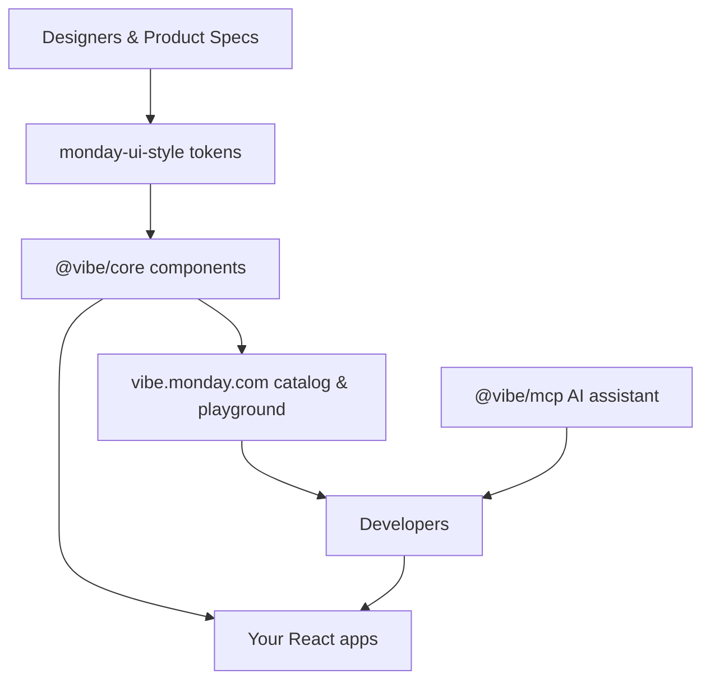

<p align="center">
  
  <h1 align="center">Vibe Design System</h1>
</p>

<p align="center">
Official <a href="https://monday.com">monday.com</a> UI resources for application development in React.js
</p>

<p align="center">
  
  <a href="https://bundlephobia.com/package/@vibe/core"></a>
  <a href="https://www.npmjs.com/package/@vibe/core"></a>
  <a href="https://github.com/mondaycom/vibe/stargazers"></a>
</p>

<p align="center">
  <a href="https://vibe.monday.com">Documentation</a> •
  <a href="https://vibe.monday.com/?path=/docs/catalog--docs">Catalog</a> •
  <a href="https://vibe.monday.com/?path=/story/playground--playground">Playground</a>
</p>

> Build cohesive monday.com experiences faster with ready-to-ship components, design tokens, documentation, and AI assistance.

## Overview

Vibe Design System packages monday.com's product language into React components, design tokens, icons, and tooling so every team can ship cohesive UI without reinventing the basics. It helps you:

- launch new product areas with predictable behavior and accessibility baked in
- theme experiences with the `monday-ui-style` token pipeline and CSS variables
- keep designers, developers, docs, and automation in sync through shared tooling

## System Diagram

The system keeps every surface aligned—from product specs, through components, to your app deployments.



## Highlights

- **Composable React components**: Buttons, forms, layout primitives, charts, navigation, and more with prop typing and theming baked in.
- **Design-token pipeline**: Consume the same `monday-ui-style` values that power monday.com's production UI via `@vibe/core/tokens`.
- **Playground-first docs**: Storybook playground, catalog, and migration guides show live code so teams can copy/paste working snippets.
- **Automation ready**: Codemods, testkits, and the MCP AI helper keep refactors safe and speed up repetitive work.

## Getting Started

### Install the core package

```bash
npm install @vibe/core
# or
yarn add @vibe/core
```

### Load the design tokens

Import the token bundle once near your app root to expose CSS variables and typography rules:

```javascript
import "@vibe/core/tokens";
```

### Create your first screen

```tsx
import React from "react";
import { Flex, Button, Text, IconButton } from "@vibe/core";
import { Icon } from "@vibe/icons";

export function DashboardHeader() {
  return (
    <Flex
      justify="space-between"
      align="center"
      gap="small"
      style={{
        padding: "var(--spacing-xl)",
        backgroundColor: "var(--surface-raised)",
        borderRadius: "var(--radius-large)",
        boxShadow: "var(--shadow-medium)"
      }}
    >
      <Flex direction="column" align="start" gap="xs">
        <Text type="h2">Team Pulse</Text>
        <Text color="primary-text">Track launches, unblock teammates, and celebrate wins.</Text>
      </Flex>
      <Flex align="center" gap="xs">
        <IconButton
          ariaLabel="Share board"
          icon={<Icon icon="Share" />}
          tooltipContent="Share with another workspace"
        />
        <Button kind="primary">Create item</Button>
      </Flex>
    </Flex>
  );
}
```

## Usage Examples

### Contextual action bar

```tsx
import React, { useMemo } from "react";
import { Flex, Button, Dropdown, Text } from "@vibe/core";

export const BoardActions = () => {
  const recipeOptions = useMemo(
    () => [
      { value: "recent", label: "Recently used" },
      { value: "popular", label: "Popular" },
      { value: "custom", label: "Custom recipes" }
    ],
    []
  );

  return (
    <Flex
      justify="space-between"
      align="center"
      wrap
      gap="small"
      style={{ borderBottom: "1px solid var(--ui-border-color)", padding: "var(--spacing-large)" }}
    >
      <Text type="h3">Automation Center</Text>
      <Flex gap="xs" align="center">
        <div style={{ minWidth: 220 }}>
          <Dropdown
            placeholder="Filter recipes"
            options={recipeOptions}
            ariaLabel="Filter automation recipes"
            clearAriaLabel="Clear filter"
          />
        </div>
        <Button kind="secondary">Preview workflow</Button>
        <Button kind="primary">Add automation</Button>
      </Flex>
    </Flex>
  );
};
```

### Guided data entry

```tsx
import React from "react";
import { Flex, FieldLabel, TextField, InfoText, Button } from "@vibe/core";

export const WorkspaceForm = () => (
  <form
    style={{
      display: "grid",
      gap: "var(--spacing-medium)",
      padding: "var(--spacing-xl)",
      maxWidth: 420
    }}
  >
    <Flex direction="column" align="start" gap="xs">
      <FieldLabel htmlFor="workspace-name">Workspace name</FieldLabel>
      <TextField id="workspace-name" placeholder="Marketing HQ" />
      <InfoText>Choose something memorable so teammates can find it quickly.</InfoText>
    </Flex>
    <Flex direction="column" align="start" gap="xs">
      <FieldLabel htmlFor="workspace-purpose" optional>
        What will you track?
      </FieldLabel>
      <TextField id="workspace-purpose" placeholder="Campaign planning, design sprints..." />
    </Flex>
    <Button kind="primary" type="submit">
      Create workspace
    </Button>
  </form>
);
```

### MCP

Vibe includes an MCP (Model Context Protocol) server that provides intelligent assistance for working with Vibe components. The MCP server can help you discover component APIs, get usage examples, find appropriate icons, and follow best practices.

To get started, follow the installation instructions in the [@vibe/mcp](https://github.com/mondaycom/vibe/blob/master/packages/mcp/README.md) docs to integrate it in your preferred AI development tools.

## Ecosystem

- [@vibe/core](https://github.com/mondaycom/vibe/blob/master/packages/core/README.md): Core component library
- [@vibe/icons](https://github.com/mondaycom/vibe/blob/master/packages/icons/README.md): Icons library
- [@vibe/testkit](https://github.com/mondaycom/vibe/blob/master/packages/testkit/README.md): Testing utilities for Playwright
- [@vibe/codemod](https://github.com/mondaycom/vibe/blob/master/packages/codemod/README.md): Codemods and CLI tools
- [monday-ui-style](https://github.com/mondaycom/vibe/blob/master/packages/style/README.md): Styling foundations (included in @vibe/core)
- [vibe-storybook-components](https://github.com/mondaycom/vibe/blob/master/packages/storybook-blocks/README.md): Vibe Storybook Blocks
- [storybook-addon-playground](https://github.com/mondaycom/storybook-addon-playground/): A Component Playground Addon for Storybook
- [@vibe/mcp](https://github.com/mondaycom/vibe/blob/master/packages/mcp/README.md): MCP server for Vibe Design System

## Older Versions

Vibe 2 ([`monday-ui-react-core`](https://www.npmjs.com/package/monday-ui-react-core)) will no longer receive new features or enhancements but will continue to receive critical bug fixes as needed. We highly recommend following the [migration guide](http://vibe.monday.com/?path=/docs/migration-guide--docs) to upgrade to the actively maintained Vibe 3, which includes the latest improvements, new components, and ongoing support.

For version 2 documentation, see [vibe.monday.com/v2](https://vibe.monday.com/v2).

## Contributing

We welcome and encourage every contributor! Please read our [Contribution Guide](http://vibe.monday.com/?path=/docs/contributing--docs).

## Suggestions

If you have any questions or suggestions, please feel free to open a [discussion](https://github.com/mondaycom/vibe/discussions).

Found a bug? Please [open an issue](https://github.com/mondaycom/vibe/issues/new/choose).

---

😄 Funny note: If your UI feels sleepy, just run `npm install @vibe/core`—it’s the design-system equivalent of a double espresso.
