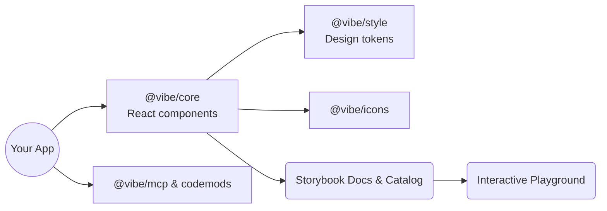

<p align="center">
  
  <h1 align="center">Vibe Design System</h1>
</p>

<p align="center">
Official <a href="https://monday.com">monday.com</a> UI resources for building React applications with consistent, accessible experiences.
</p>

<p align="center">
  
  <a href="https://bundlephobia.com/package/@vibe/core"></a>
  <a href="https://www.npmjs.com/package/@vibe/core"></a>
  <a href="https://github.com/mondaycom/vibe/stargazers"></a>
</p>

<p align="center">
  <a href="https://vibe.monday.com">Documentation</a> •
  <a href="https://vibe.monday.com/?path=/docs/catalog--docs">Catalog</a> •
  <a href="https://vibe.monday.com/?path=/story/playground--playground">Playground</a>
</p>

## Overview

Vibe bundles UI components, icons, tokens, tooling, and documentation so product teams can ship polished monday.com experiences faster. Each package is versioned together in this monorepo, ensuring that design guidance, accessibility rules, and developer ergonomics evolve in sync.

### System Diagram



## Key Features

- **Composable components** built with TypeScript, hooks, and design token fidelity.
- **Design tokens & theming** via `@vibe/style`, keeping spacing, color, and typography aligned with monday.com's brand.
- **Rich documentation** powered by Storybook catalog, playground, and migration guides for legacy stacks.
- **Developer tooling** such as codemods, Playwright testkit, and an MCP server that surfaces API hints inside AI-assisted IDEs.
- **Accessibility baked-in** with focus-management primitives, keyboard support, and WCAG-driven guidelines.

## Installation

```bash
npm install @vibe/core
# or
yarn add @vibe/core
```

1. Ensure your bundler handles CSS imports (e.g., with `css-loader` in Webpack or the default Next.js setup).
2. Import the design tokens once near your app root so CSS variables are registered:

```javascript
import "@vibe/core/tokens";
```

3. (Optional) Install companion packages when you need them:

```bash
yarn add @vibe/icons @vibe/storybook-blocks
```

## Usage Examples

```tsx
import { Button, Flex, Heading, Text } from "@vibe/core";

export const WelcomeCard = () => (
  <Flex direction="column" gap={16}>
    <Heading size="large">Welcome to Vibe</Heading>
    <Text color="primary">Ship monday.com-quality UI in minutes.</Text>
    <Button kind="primary" onClick={() => console.log("Clicked!")}>
      Get started
    </Button>
  </Flex>
);
```

### MCP-assisted development

Vibe ships an MCP (Model Context Protocol) server that plugs into AI coding assistants. It can surface component props, usage recipes, icon suggestions, and migration guidance directly in your editor. Follow the setup steps in the [@vibe/mcp README](https://github.com/mondaycom/vibe/blob/master/packages/mcp/README.md) to enable it.

## Configuration

- **Global tokens:** Keep `@vibe/core/tokens` loaded once; override exposed CSS variables (e.g., `--vibe-color-primary`) at the application level to align with brand palettes.
- **Tree-shaking:** All packages are ESM-first; ensure your bundler preserves module syntax (e.g., `sideEffects: false` for components, while SCSS files remain side-effectful).
- **Theming + RTL:** Consume the `ThemeProvider` utilities under `@vibe/core` to flip layout direction or opt into monday.com themes without manual overrides.
- **Testing:** Use `@vibe/testkit` for Playwright-ready selectors and helpers that mirror production behavior.
- **Codemods:** Run `npx @vibe/codemod migrate` to adopt breaking changes automatically during upgrades.

## Contribution Guidelines

We welcome and encourage community contributions:

- Review the [Contribution Guide](http://vibe.monday.com/?path=/docs/contributing--docs) for branch strategy, lint rules, and PR expectations.
- Before opening a PR, run `yarn lint` and `yarn test` to ensure CI parity.
- Discuss large component ideas in [GitHub Discussions](https://github.com/mondaycom/vibe/discussions) to align on UX, accessibility, and API surface area.

## Ecosystem

- [@vibe/core](https://github.com/mondaycom/vibe/blob/master/packages/core/README.md): Core component library
- [@vibe/icons](https://github.com/mondaycom/vibe/blob/master/packages/icons/README.md): Icons library
- [@vibe/testkit](https://github.com/mondaycom/vibe/blob/master/packages/testkit/README.md): Testing utilities for Playwright
- [@vibe/codemod](https://github.com/mondaycom/vibe/blob/master/packages/codemod/README.md): Codemods and CLI tools
- [monday-ui-style](https://github.com/mondaycom/vibe/blob/master/packages/style/README.md): Styling foundations (included in @vibe/core)
- [vibe-storybook-components](https://github.com/mondaycom/vibe/blob/master/packages/storybook-blocks/README.md): Vibe Storybook Blocks
- [storybook-addon-playground](https://github.com/mondaycom/storybook-addon-playground/): A Component Playground Addon for Storybook
- [@vibe/mcp](https://github.com/mondaycom/vibe/blob/master/packages/mcp/README.md): MCP server for Vibe Design System

## Older Versions

Vibe 2 ([`monday-ui-react-core`](https://www.npmjs.com/package/monday-ui-react-core)) no longer receives new features but continues to get critical fixes. Follow the [migration guide](http://vibe.monday.com/?path=/docs/migration-guide--docs) to upgrade to Vibe 3 for the latest components and support. Legacy documentation remains at [vibe.monday.com/v2](https://vibe.monday.com/v2).

## Support & Suggestions

- Questions or ideas? Start a [discussion](https://github.com/mondaycom/vibe/discussions).
- Found a bug? [Open an issue](https://github.com/mondaycom/vibe/issues/new/choose) with reproduction details.

## Tracking

- Monday.com task: [Item #10674006987](https://view.monday.com/10674006987)
